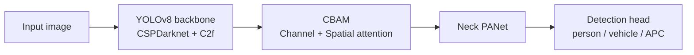
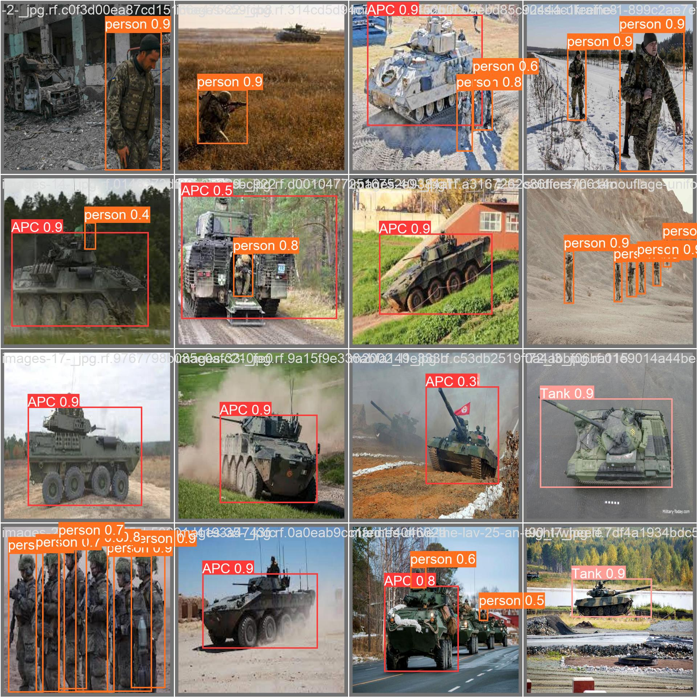
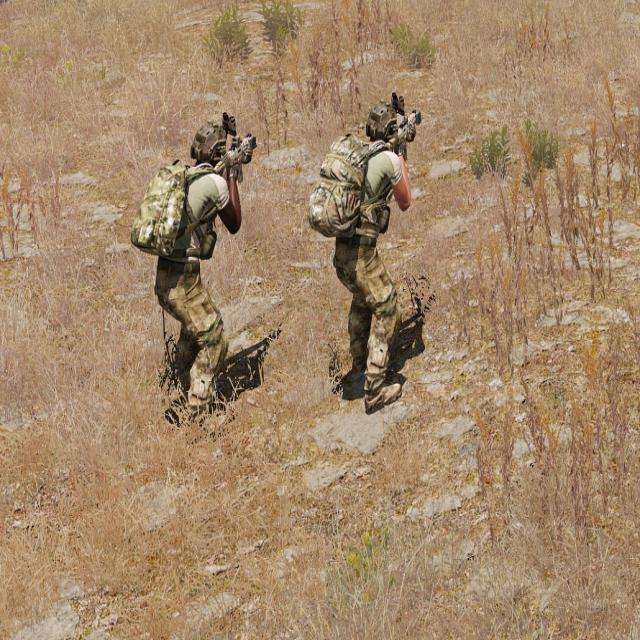

# ARAKON — Defense Reconnaissance AI Model

> Sep 2025 – Jan 2026 · **Team project** (Konkuk Dream Semester)
> Detecting camouflaged / occluded military targets in real time.

## Overview

Modern reconnaissance generates more imagery than humans can analyze in real time. ARAKON is a defense-reconnaissance AI that detects military targets — **personnel, vehicles, and APCs** — accurately even under camouflage, occlusion, and difficult terrain. The goal was not to chase SOTA, but to engineer a deployable model tuned to the constraints of the reconnaissance domain (speed + accuracy on edge-class hardware).

## Architecture

Final model: **YOLOv8 backbone + CBAM (Convolutional Block Attention Module)**.

CBAM is inserted after each feature level (P3, P4, P5) before the PANet neck. It applies **channel attention** (which feature channels matter — texture, color) and **spatial attention** (where the object is), letting the lightweight YOLOv8 suppress background noise and lock onto camouflaged targets with minimal added compute.

## Architecture search

The team evaluated several approaches before settling on YOLOv8+CBAM:

| Approach | Outcome |
|----------|---------|
| HybridTwoWay (CNN + ViT) | Rejected — gradient instability, slow/unstable training |
| SAM (Segment Anything) | Rejected — strong segmentation but too heavy; couldn't meet real-time/edge constraints |
| **YOLOv8 + CBAM** | **Adopted** — best speed/accuracy trade-off for the domain |

## Results

CBAM consistently improved detection over the YOLOv8 baseline:

| Class | Baseline | + CBAM | Δ |
|-------|----------|--------|---|
| APC (장갑차) | 0.85 | **0.92** | +7%p |
| Tank (전차) | 0.86 | **0.89** | +3%p |
| Person | 0.80 | **0.83** | +3%p |

Final model: **mAP@50 ≈ 0.93** after hyperparameter optimization.

   
  YOLOv8 + CBAM detections on the validation set (person / vehicle / APC / tank)

## My role

- **Data collection & annotation** — gathered military imagery via web scraping and synthetic **ARMA 3** simulation scenarios; labeled **1,800+** images (3 classes) using Roboflow.

   
  Synthetic training scenario generated in ARMA 3

- **Experiments** — ran the architecture-search comparison and the hyperparameter tuning (class/box/DFL loss weights, Cosine Annealing LR, Mosaic/MixUp augmentation).

## Tech stack

`Python` · `YOLOv8` · `CBAM` · `PyTorch` · `Roboflow`
