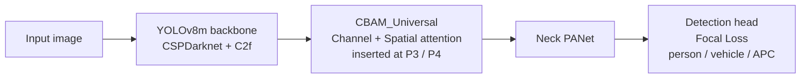
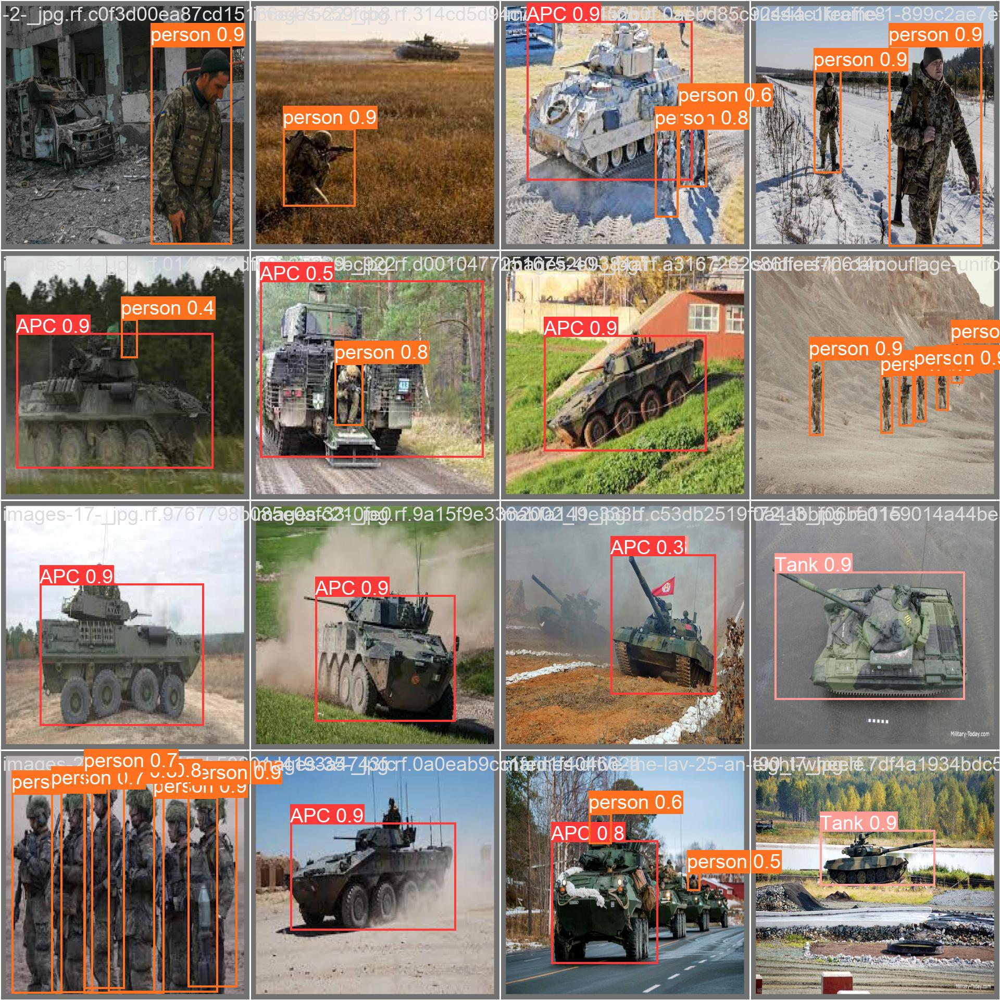
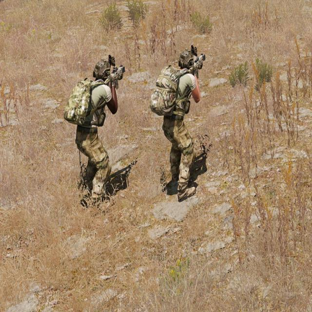

# ARAKON — Defense Reconnaissance AI Model

> Sep 2025 – Jan 2026 · **Team project** (Konkuk Dream Semester)
> Detecting camouflaged / occluded military targets in real time.

## Overview

Modern reconnaissance generates more imagery than humans can analyze in real time. ARAKON is a defense-reconnaissance AI that detects military targets — **personnel, vehicles, and APCs** — accurately even under camouflage, occlusion, and difficult terrain. The goal was not to chase SOTA, but to engineer a deployable model tuned to the constraints of the reconnaissance domain (speed + accuracy on edge-class hardware).

## Architecture

Final model: a **custom YOLOv8m backbone with CBAM (Convolutional Block Attention Module)** trained with **Focal Loss**.

```mermaid
flowchart LR
    A[Input image] --> B[YOLOv8m backbone<br/>CSPDarknet + C2f]
    B --> C[CBAM_Universal<br/>Channel + Spatial attention<br/>inserted at P3 / P4]
    C --> D[Neck PANet]
    D --> E[Detection head<br/>Focal Loss<br/>person / vehicle / APC]
```

A custom `CBAM_Universal` module (defined in the model YAML) is inserted after the C2f blocks at multiple backbone stages. It applies **channel attention** (which feature channels matter — texture, color) and **spatial attention** (where the object is), letting the model suppress background clutter and lock onto camouflaged targets with minimal added compute. **Focal Loss** down-weights easy negatives to focus training on the hard, occluded targets that dominate the reconnaissance domain.

## Architecture search

Several approaches were evaluated before settling on YOLOv8m + CBAM:

| Approach | Outcome |
|----------|---------|
| HybridTwoWay (CNN + ViT) | Rejected — gradient instability, slow/unstable training |
| SAM (Segment Anything) | Rejected — strong segmentation but too heavy; couldn't meet real-time/edge constraints |
| **YOLOv8m + CBAM + Focal Loss** | **Adopted** — best speed/accuracy trade-off for the domain |

## Results

The CBAM + Focal-Loss model clearly outperformed a standard YOLOv8 baseline (val: 132 images, 271 instances):

| Model | mAP@50 | mAP@50-95 | Precision | Recall |
|-------|--------|-----------|-----------|--------|
| YOLOv8 baseline | 0.883 | 0.639 | 0.886 | 0.826 |
| **YOLOv8m + CBAM + Focal Loss** | **0.924** | **0.698** | 0.942 | 0.871 |
| Δ | **+4.1%p** | **+5.9%p** | — | — |

To push the last bit of accuracy, I also built a **multi-scale ensemble**: 640- and 800-px models fused with **Weighted Box Fusion (WBF)** and **test-time augmentation (TTA)**, plus a **SAHI** (Slicing Aided Hyper Inference) pipeline for small/distant targets.

   
  YOLOv8m + CBAM detections on the validation set (person / vehicle / APC / tank)

## My role

- **Data collection & annotation** — gathered military imagery via web scraping and synthetic **ARMA 3** simulation scenarios; labeled **1,800+** images (3 classes) using Roboflow.

   
  Synthetic training scenario generated in ARMA 3

- **Modeling & experiments** — designed the custom YOLOv8m + CBAM architecture (YAML), tuned Focal Loss and training hyperparameters, ran the architecture-search comparison, and built the WBF ensemble / TTA / SAHI evaluation pipeline against a YOLOv8 baseline.

## Tech stack

`Python` · `YOLOv8m (Ultralytics)` · `CBAM` · `Focal Loss` · `WBF (ensemble-boxes)` · `SAHI` · `PyTorch` · `Roboflow`
