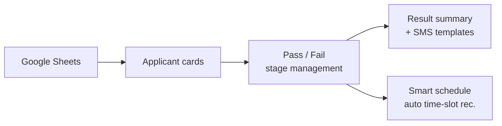

# CampusForm — Club Recruitment Platform

> Sep 2025 – Feb 2026 · **Frontend** · Team · 🏆 Grand Prize (Kuit 6th Demoday 2026)

### 🔗 Live Service — **[web.campusform.kro.kr](https://web.campusform.kro.kr/)** · [Repository](https://github.com/Konkuk-KUIT/CAMPUSFORM-Web)

## Overview

University club recruiting is scattered across Google Forms, manual spreadsheet work, mass texting, and hand-built interview timetables. CampusForm unifies the entire flow into one service: application collection → document/interview pass-fail management → result summaries & SMS templates → smart interview scheduling.

Won **Grand Prize at Kuit 6th Demoday**.

## Architecture

Built on **Next.js (App Router)** with feature-based routing — `auth`, `home`, `document`, `interview`, `manage`, `oauth`, `smart-schedule` — and Zustand for global state.

## My role

Frontend developer on a 3-person FE team. I built the **Home / My / Manage / Notification** pages and implemented & integrated the **smart interview scheduling** feature — automatic time-slot recommendation with applicant-side self-adjustment.

## Tech stack

`Next.js` · `TypeScript` · `React` · `Zustand` · `TailwindCSS` · `Vercel`
