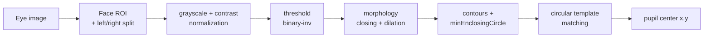
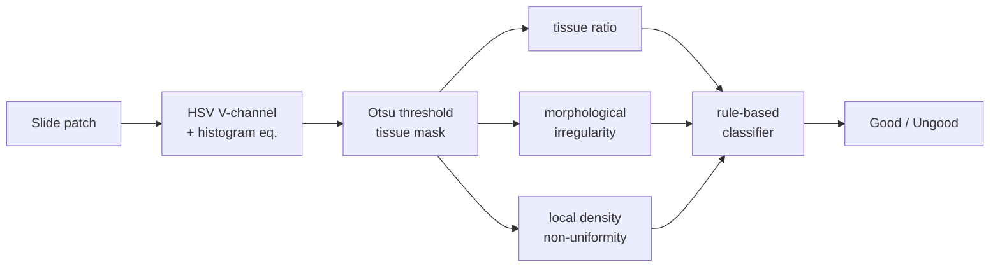

# Digital Image Processing — Classical CV

> 2025 · Digital Image Processing coursework · **Solo**
> Two vision tasks solved with **classical image processing only** — deep-learning feature extraction / classification was explicitly forbidden.

A counterpoint to my deep-learning work: these show I can solve vision problems by hand-engineering features and rules, and that I understand the fundamentals beneath modern detectors.

---

## Task 1 — Eye Image Segmentation

Detect the eye region and locate the **pupil center** across multiple modalities (IR / RGB / Depth), marking the pupil as a circle.

- Contrast normalization (min–max stretch) for stable thresholding across lighting
- Binary-inverse threshold + morphology (closing/dilation) to isolate the dark pupil
- Contour filtering with `minEnclosingCircle` over a valid radius range to reject noise
- **Multi-radius circular template matching** restricted to the central region; pick the radius with best normalized correlation
- Per-eye localization (split face ROI into halves), mapped back to global coordinates
- Evaluated by **match-rate within 5-pixel error** against ground-truth labels

---

## Task 2 — Pathology Slide Classification

Classify pathology-slide image patches as **Good** (normal tissue) vs **Ungood** (cancer-suspected) using only hand-engineered image features and rules.

Three hand-engineered features from the Otsu tissue mask:

| Feature | What it captures |
|---------|------------------|
| **Tissue ratio** | Global tissue density (V-channel + histogram equalization + Otsu) |
| **Morphological irregularity** | Boundary noise/loss — pixel change after morphological opening |
| **Local density non-uniformity** | Local empty regions via a sliding mean filter (vacancy density) |

A threshold-based rule classifier flags a patch as Ungood if tissue ratio is too low, or morphological irregularity / local vacancy exceed their thresholds — otherwise Good. Thresholds were tuned on the labeled example set; predictions produced for the unlabeled test set.

---

## Tech stack

`Python` · `OpenCV` · `NumPy` · `pandas`
