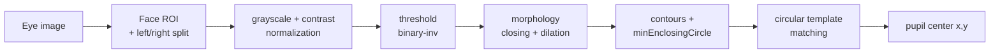

# Eye Image Segmentation

> 2025 · Digital Image Processing coursework · **Solo**
> Pupil & eye-region detection using **classical image processing only** (no deep learning).

## Overview

Detect the eye region and locate the **pupil center** in eye images, marking the pupil as a circle, across multiple modalities (IR / RGB / Depth) and subjects/distances. The assignment explicitly **forbade deep-learning feature extraction or classification** — the pupil-localization logic had to be built from classical image-processing techniques taught in the course.

## Pipeline

## Techniques

- **Contrast normalization** — min–max stretch to 0–255 for stable thresholding across lighting.
- **Thresholding + morphology** — binary-inverse threshold to isolate the dark pupil, then closing + dilation to clean the mask.
- **Contour filtering** — `minEnclosingCircle` with a valid pupil-radius range to reject noise blobs.
- **Multi-radius circular template matching** — build circular templates over a radius sweep, pick the radius with the best normalized correlation, and restrict the search to the central region to avoid edge false matches.
- **Per-eye handling** — split the face ROI into left/right halves and localize each pupil independently, mapping back to global coordinates.

## Evaluation

Predicted pupil centers are compared to ground-truth labels; accuracy is reported as the **match rate within a 5-pixel error** for left/right eyes on the labeled example subjects, with prediction CSVs produced for the unlabeled test set.

## Why it matters

A counterpoint to my deep-learning work — this project shows I can solve a vision problem with **hand-built classical CV** (thresholding, morphology, template matching) and understand the fundamentals beneath modern detectors.

## Tech stack

`Python` · `OpenCV` · `NumPy` · `pandas`
