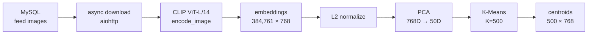

# INPOSE — AI-Driven Matching & CRM System

> Capstone project (Mar 2026 – Dec 2026) · **Solo**
> Production ML pipeline for semantic feed clustering and behavior-based recommendation.

## Overview

INPOSE is the AI CRM behind the social-matching service *Inpose*. The feed contains hundreds of thousands of user-posted images with no semantic labels. INPOSE automatically groups them into meaningful clusters by **visual semantics** (style, subject, composition), then learns each user's interaction history to model their taste.

The **end goal** is personalized recommendation on two surfaces: **job/recruitment posts** and the **image feed** — surfacing the postings and feeds that best match each user's inferred preferences.

The system has two halves:
1. **A clustering pipeline** that turns raw images into a fixed set of semantic clusters.
2. **A real-time inference + recommendation server** that assigns new images to clusters and computes per-user preference.

### Current status

This is an ongoing capstone (Mar–Dec 2026). As of the first semester, the **feed clustering pipeline** and the **user–cluster mapping (preference module)** are implemented and deployed. The **CRM / recommendation layer** that consumes these signals is the next phase and not yet built.

| Component | Status |
|-----------|--------|
| Feed image clustering (CLIP + K-Means) | ✅ Done |
| Real-time cluster inference (FastAPI) | ✅ Done |
| User–cluster preference mapping | ✅ Done |
| CRM / recommendation layer (job posts + feed) | 🔜 Planned |

## Architecture

### Training pipeline

### Real-time inference

The CLIP model (~2.4s init) and centroids are loaded once at server start and reused — a singleton service pattern that brings per-request latency down to ~13 ms.

## Key design decisions

- **CLIP ViT-L/14 (768-dim)** over ViT-B variants — richer semantic representation for style/subject/composition.
- **K-Means over DBSCAN / HDBSCAN** — density-based methods failed on CLIP's high-dimensional, continuous embedding space (DBSCAN collapsed everything into 1–2 clusters or pure noise; HDBSCAN produced an unpredictable cluster count). K-Means gives a fixed cluster count, no noise points, and savable centroids — exactly what a production service needs.
- **K=500 chosen by qualitative evaluation** — standard metrics (silhouette, Davies-Bouldin) favored K≈10, which lumped ~40K images per cluster and destroyed the goal of fine-grained grouping. I instead compared K=300/500/700 on visual/semantic coherence within clusters and selected K=500 as the best balance.
- **Centroids stored in original 768-dim** — inference needs no PCA model, just `centroids.npy`, minimizing deployment dependencies.

## Results

| Metric | Value |
|--------|-------|
| Training images | 384,761 |
| Embedding dim | 768 (CLIP ViT-L/14) |
| Clusters | 500 |
| End-to-end inference | **~13 ms/image** |
| Throughput | **~78.8 img/s** (GPU) |
| Cluster assignment | ~1 ms |

## User preference module

Aggregates each user's `view / like / comment / scrap` interactions per cluster, applies configurable weights, and returns the top-N preferred clusters — used to drive feed and match recommendations.

## My role

Solo developer. Designed and implemented everything built so far **single-handedly** — embedding extraction, the algorithm-selection study, the clustering pipeline, the real-time inference server (FastAPI), the user-affinity mapping module, and its production deployment. The CRM recommendation layer on top is the planned next phase.

## Tech stack

`Python` · `PyTorch` · `OpenAI CLIP (ViT-L/14)` · `scikit-learn (KMeans, PCA)` · `FastAPI` · `MySQL` · `aiohttp` · `CUDA`
