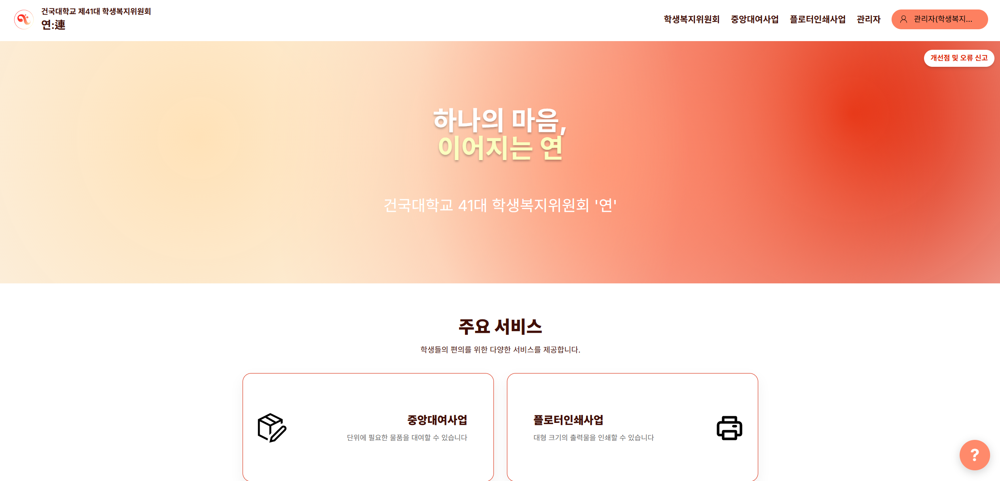
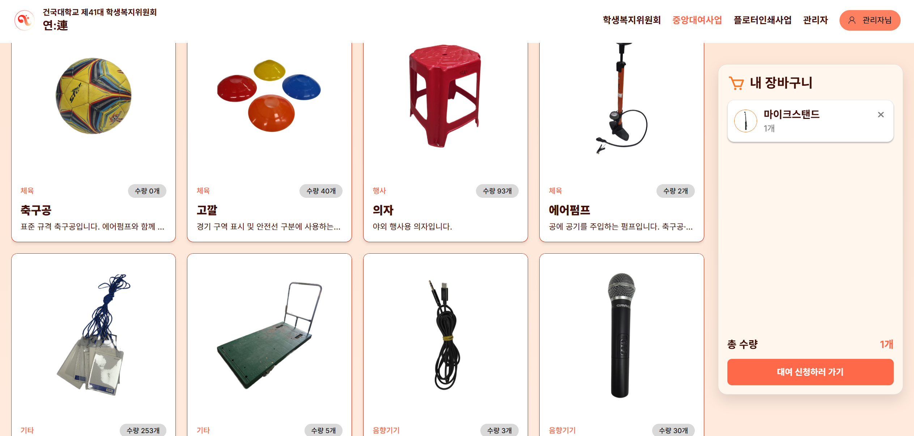
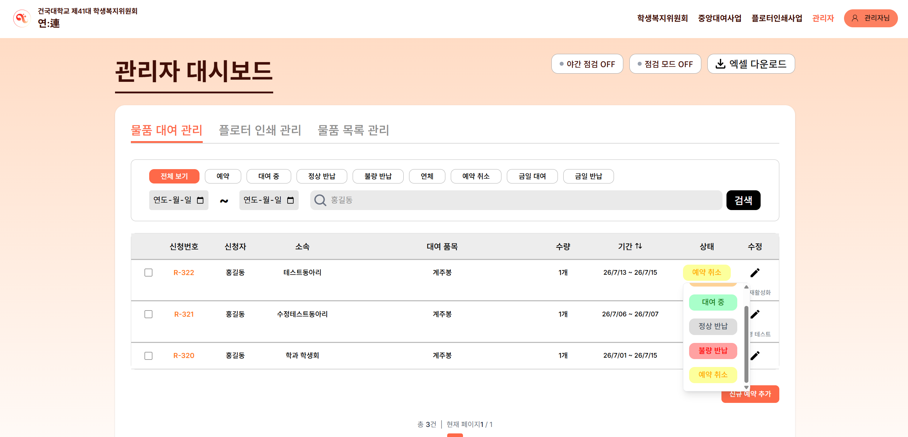
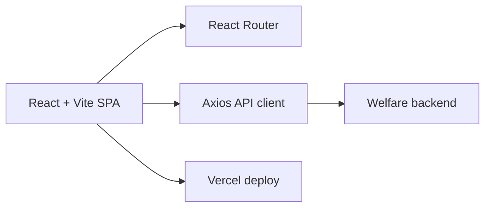

# KU Welfare Web — Rental & Printing Portal

> Jan 2026 – Present · **PM + Frontend** · Team of 2 · Live in production

### 🔗 Live Service — **[ku-welfare-web.vercel.app](https://ku-welfare-web.vercel.app/)** · [Repository](https://github.com/41-Welfare-Web)

## Overview

The official web portal of Konkuk University's 41st Student Welfare Committee. It digitalizes campus welfare operations — item rental and printing services — that were previously handled manually, drastically reducing administrative overhead. Currently **live and serving students**.

   
  Landing page

<table>
<tr>
<td width="50%"> Student view — rental catalog & cart</td>
<td width="50%"> Admin dashboard — rental/print management</td>
</tr>
</table>

## Architecture

A React 19 + Vite single-page app, styled with TailwindCSS 4, talking to the welfare backend through an Axios client, deployed on Vercel.

## My role

Project planning (PM), frontend architecture & implementation, Vercel deployment, and ongoing maintenance/operations (2-person team). The service is live and actively maintained.

## Tech stack

`React` · `TypeScript` · `Vite` · `TailwindCSS` · `React Router` · `Axios` · `Vercel`
