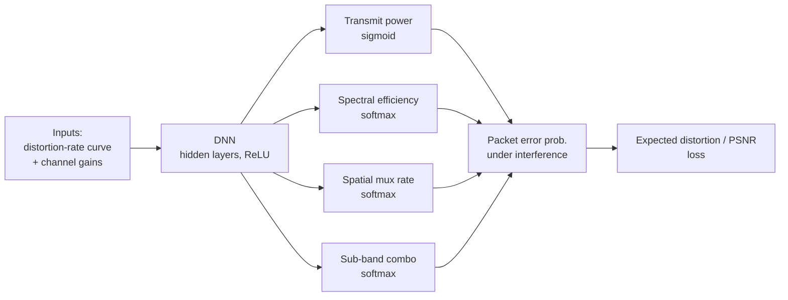

# DL-Based Image Transmission & Frequency Allocation

> AI & Mobile Lab, Konkuk University · RUS Program (Jan 2025 – Jun 2026)
> Advisor: Prof. Seok-Ho Chang · **Published — KICS Summer Conference 2026**

## Overview

How should a progressive image be transmitted over a noisy, interference-prone wireless channel so that the *average* reconstructed quality across many links is maximized? In progressive image transmission, earlier packets matter more than later ones — if a front packet is corrupted, the trailing packets become useless. This research designs a **neural-network-based resource allocation** scheme for **progressive image transmission over multi-frequency-band MIMO interference channels**.

## Problem & approach

For each packet of each link, the model jointly decides:
- **Spectral efficiency** (how densely to encode)
- **Spatial multiplexing rate** (how many antenna streams)
- **Sub-band combination** (which frequency bands to use)
- **Per-link transmit power**

Choosing more sub-bands raises the per-packet source bits but splits the transmit power across them and changes inter-link interference — a coupled trade-off the network must learn.

## Architecture

- Sub-band selection is represented as **softmax probabilities**, making the whole pipeline end-to-end differentiable.
- The loss is built from **expected distortion / PSNR**, computed from per-packet error probabilities that account for interference between links sharing a sub-band.
- At inference, the argmax candidate is chosen for each discrete decision; power uses the sigmoid output directly.

## Publication

> Minjae Kim, **Sehyun Cho**, Seok-Ho Chang, *"Neural Network-Based Optimal Image Transmission Over Multiple-Frequency Band Interference Channels,"* **KICS Summer Conference 2026** (한국통신학회 2026년도 하계종합학술발표회), July 2026.

## My role

Co-author. Contributed to the model formulation (multi-frequency-band extension, sub-band selection via softmax, PSNR-based loss) and the experiments behind the paper.

> Note: the simulation code remained with the lab; this page summarizes the research and methodology.

## Keywords

`Progressive image transmission` · `MIMO interference channel` · `Multi-frequency band` · `DNN resource allocation` · `PSNR`
