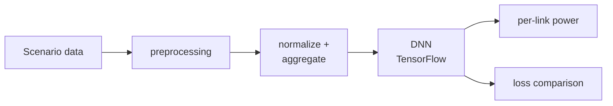
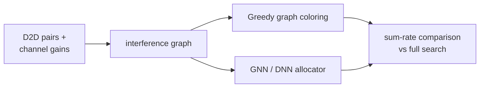

# Task-Oriented Communication — Power & Frequency Allocation

> AI & Mobile Lab, Konkuk University · Industry-Academia Research (2025)

## Overview

Industry-academia research on deep-learning-based resource allocation for D2D wireless networks. The goal: allocate **transmit power** and **frequency** across links to maximize sum rate while controlling interference — replacing slow exhaustive search with a fast, learned allocator.

## DNN-based power allocation

- Built the full training pipeline across multiple network scenarios, including data preprocessing, aggregation, normalization, and weight/loss logging.
- Ran a comparison study of different loss formulations, organized by scenario / sample size / learning rate for systematic evaluation.

## Graph-based frequency allocation

A complementary line of work modeling frequency allocation for D2D pairs as a **graph problem**:

- Built an interference graph (nodes = D2D pairs, edges = interference above threshold) and applied **graph-coloring** for frequency assignment.
- Benchmarked DNN / GNN allocators against greedy coloring and an exhaustive-search baseline on sum rate.

## My role

Implemented the DNN power-allocation training/evaluation pipeline (TensorFlow) and the graph-based frequency-allocation experiments, and ran the comparative benchmarks.

## Tech stack

`Python` · `TensorFlow` · `PyTorch` · `NumPy` · `scikit-learn`
