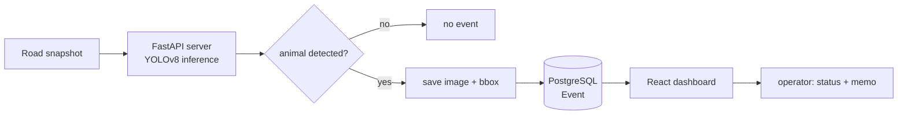

# Roadkill Detection Assist System

> 2026 · Major-Deepening Project (Konkuk University) · **Team of 4 (AI role)**
> AI-assisted traffic-control system that screens road images for animals/carcasses.

## Overview

Traffic-control operators must watch many CCTV feeds at once — fatiguing, and easy to miss a small object at night or in bad weather, where a late-spotted roadkill can cause secondary accidents. This system does **not** replace the operator; it pre-screens road snapshots with AI so a human only reviews images that actually contain an animal, then decides dispatch/false-alarm via a dashboard.

The project's other theme was **agentic AI-assisted development** — the whole team built it through a controlled LLM workflow (skill files, context packets, human approval gates) rather than ad-hoc prompting.

## System architecture

The team chose **periodic snapshot polling** over real-time video streaming to fit student-level infra, and integrated YOLOv8 directly inside the FastAPI app (single EC2 + Docker Compose) to cut network latency.

## My role — AI

I owned the **AI pipeline** end-to-end:

- **Data** — converted AIHub labels to YOLO format and trained YOLOv8 on **67,275 train / 16,820 val** images across 3 classes (water deer, wild boar, raccoon).
- **Data-existence gate** — the LLM assumed source images existed and wrote "working" training code; I added a verification gate (recursive image indexing, label↔image matching, `RuntimeError` on 0 matches) so a missing-data failure surfaces loudly instead of silently.
- **Two-stage confidence threshold** — rejected the LLM's single-threshold design; detect loosely at **0.3** (minimize misses) but alert conservatively at **0.6** (suppress false alarms), tuned on a held-out validation set.
- **Inference → alert pipeline** — JSON metadata schema (class, confidence, normalized bbox, UTC timestamp) consumed by the control system; Korean class mapping + webhook alert with env-separated URL.

## Results

| Metric | Value |
|--------|-------|
| Validation mAP@50 | **0.994** |
| External test (12 imgs) | precision **1.0**, recall **0.67**, accuracy **0.83** |
| Training data | 67,275 train / 16,820 val |

Reported honestly: the 0.994 is validation-set only; the external test showed 0 false alarms but 2 missed carcasses — noted as the higher-priority weakness for a safety-assist system.

## Tech stack

`Python` · `YOLOv8` · `PyTorch` · `Claude Code (Skills)` · (team: `FastAPI` · `PostgreSQL` · `React` · `Docker` · `AWS EC2`)
