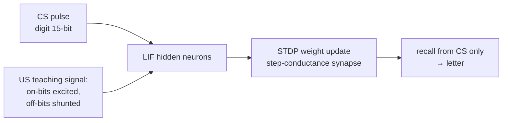

# STDP-based Heteroassociative Memory (Digit → Letter)

> KIST — CoBI Lab · neuromorphic / Spiking-Neural-Network research
> Learning a digit → letter association in a spiking network via spike-timing-dependent plasticity.

## Overview

Given a digit image as a **conditioned stimulus (CS)**, the network recalls the corresponding letter image as an **unconditioned stimulus (US)** — a **heteroassociative memory** mapping two *different* pattern sets. Each character is a **5 × 3 = 15-bit** binary image, and all **10 (digit → letter) pairs** are stored in a single set of synaptic weights.

The research question: **can a spiking network learn this association purely through local, biologically plausible plasticity?**

## Core approach — STDP spiking simulation

LIF neurons are simulated at fine time resolution and learn by **spike-timing-dependent plasticity (STDP)** — no global error signal, only local pre/post spike timing.

- **Neurons & synapses** — leaky integrate-and-fire (LIF) neurons connected by **step-conductance synapses** (with transmission delays), an engine faithfully ported from a NEURON `.mod` mechanism.
- **Plasticity** — an STDP rule updates weights multiplicatively from pre/post spike-timing differences (supporting several curve shapes, e.g. asymmetric Hebbian).
- **Teaching with nontarget inhibition** — during training the US pattern both **excites** the target (on-bit) neurons and **shunts** (inhibits) the off-bit neurons, so the network learns to fire the right bits and stay quiet on the wrong ones.
- **Recall** — with the teacher removed, a CS pulse alone drives the hidden neurons; bits whose spike count exceeds a threshold are read out as the recalled letter.

## Reference baseline — closed-form contrastive weights

To gauge how close the spiking model gets to the best possible linear solution, a non-spiking baseline computes the optimal weights analytically: a **contrastive teacher** (+1 for on-bits, −1 for off-bits) with **quadratic feature expansion**, solved in one step via the Moore–Penrose pseudo-inverse (least-squares optimum), with rank analysis to check representational capacity.

## Evaluation

Per-pair diagnostics logged to JSON — exact-match rate, bit accuracy, MSE, cosine similarity, and predicted-vs-target 5×3 grids.

## My role

Designed and implemented the project end-to-end — the dataset, the STDP spiking engine (LIF + synapse + plasticity + training/recall), and the closed-form baseline for comparison.

> A shareable subset; hardware-fitting internals are omitted.

## Tech stack

`Python` · `PyTorch` · `NumPy` · `matplotlib`
