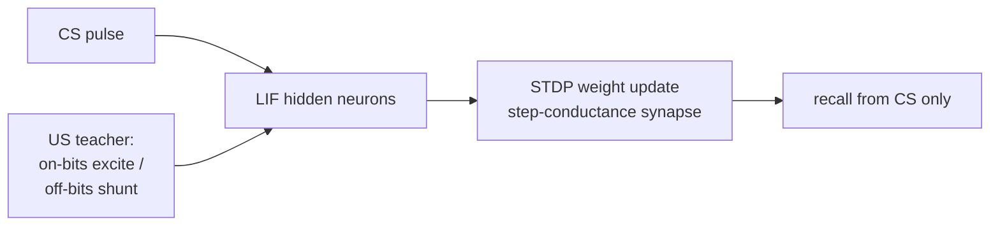

# STDP-based Heteroassociative Memory (Digit → Letter)

> KIST — CoBI Lab · neuromorphic / Spiking-Neural-Network research
> Recalling a letter (A–J) from a digit (0–9) as an associative memory.

## Overview

Given a digit image as a **conditioned stimulus (CS)**, the model recalls the corresponding letter image as an **unconditioned stimulus (US)** — a classic **heteroassociative memory** that maps two *different* pattern sets. Each character is a **5 × 3 = 15-bit** binary image, and all **10 (digit → letter) pairs** must be stored in a single weight matrix, making it a multi-pattern association problem.

Two independent tracks solve it — an analytic closed-form solution and a biologically plausible spiking simulation — sharing only the dataset.

## Track A — Contrastive optimal weight (closed-form)

Solves the association in a single linear-algebra step, no iterative training.

- **Contrastive teacher** — target bit = 1 → `+I`, bit = 0 → `−I` (pushing off-bits negative, not just zero, cleanly separates on/off bits).
- **Quadratic feature expansion** — original 15 bits + all pairwise products `xᵢ·xⱼ`, so mappings that aren't linearly separable become representable.
- **Closed-form weights** — Moore–Penrose pseudo-inverse (`torch.linalg.pinv`) gives the least-squares optimum in one shot; rank analysis of the (augmented) feature matrix checks whether the mapping is fully representable.
- **Recall** — a simple LIF pass thresholds the reconstructed pattern back into a 15-bit letter.

## Track B — STDP spiking simulation (protocol T2)

A biologically plausible route: LIF neurons simulated at fine time resolution, learning by **spike-timing-dependent plasticity (STDP)**.

- **Engine** — LIF neurons + **step-conductance synapses** (with delay queues) + an **STDP rule** faithfully ported from a NEURON `.mod` mechanism (multiple curve types: asymmetric/symmetric Hebbian, anti-Hebbian, Mexican-hat…). Weights update multiplicatively on pre/post spike timing.
- **Protocol T2 = STDP + nontarget inhibition** — during training, US-on neurons (target bit = 1) receive an excitatory drive while US-off neurons (bit = 0) receive a **shunt** that suppresses spurious firing; a gating rule applies inhibition differently *within* a pair vs. *between* pairs on the continuous training timeline.
- **Recall** — with the teacher and shunt removed, a CS pulse alone drives the hidden neurons; bits with spike count above threshold are read out as the recalled letter.

## Evaluation

Per-pair diagnostics logged to JSON — exact-match rate, bit accuracy, MSE, cosine similarity, and predicted-vs-target 5×3 grids, plus feature-matrix rank to judge representational capacity.

## My role

Designed and implemented the project end-to-end — the shared dataset, both the closed-form contrastive-optimal-weight track and the STDP T2 spiking track (LIF + synapse + STDP engine, training protocol, and recall/evaluation).

> A shareable subset; hardware-fitting internals are omitted.

## Tech stack

`Python` · `PyTorch` · `NumPy` · `matplotlib`
