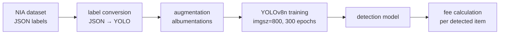

# Trash is YOLO — AI Bulky Waste Management System

> 2025 · **Solo (code & research)** · 🏆 Grand Prize ×2
> Real-time bulky-waste detection with automated disposal-fee calculation.

## Overview

Disposing of bulky household waste in Korea requires manually identifying the item, looking up its fee, and buying a sticker — a slow, error-prone process. Trash is YOLO replaces it with a camera-based AI: point at the item, the model detects it in real time, and the service automatically computes the disposal fee.

Won **two Grand Prizes** — RISE AI-LivingLab Challenge 2025 and the 誠信義 AI Academic Competition 2025.

## Architecture

## Pipeline details

- **Data** — built on the public NIA bulky-waste dataset; wrote a converter handling both `POLYGON` and `BOX` annotation formats into YOLO format.
- **Augmentation** — albumentations pipeline (horizontal flip, brightness/contrast, rotation ±15°, shift-scale-rotate) with keypoint-aware bounding-box transforms.
- **Training** — YOLOv8n at imgsz=800, 300 epochs, auto batch-size search, with separate experiments for top-only classes and a dedicated sofa classifier.
- **Service** — end-to-end prototype mapping each detected class to its disposal fee.

## Results

| Metric | Value |
|--------|-------|
| Model | YOLOv8n (imgsz=800) |
| Precision | **~98%** |
| mAP@50 | **98.1%** |
| mAP@50-95 | **93.2%** |
| Training | 300 epochs |

## My role

Owned the **full codebase end-to-end** — data pipeline, augmentation, training/validation, and the service prototype — and **led the research report** that the competition submissions were built on.

## Tech stack

`Python` · `YOLOv8 (Ultralytics)` · `albumentations` · `OpenCV` · `PyTorch`
